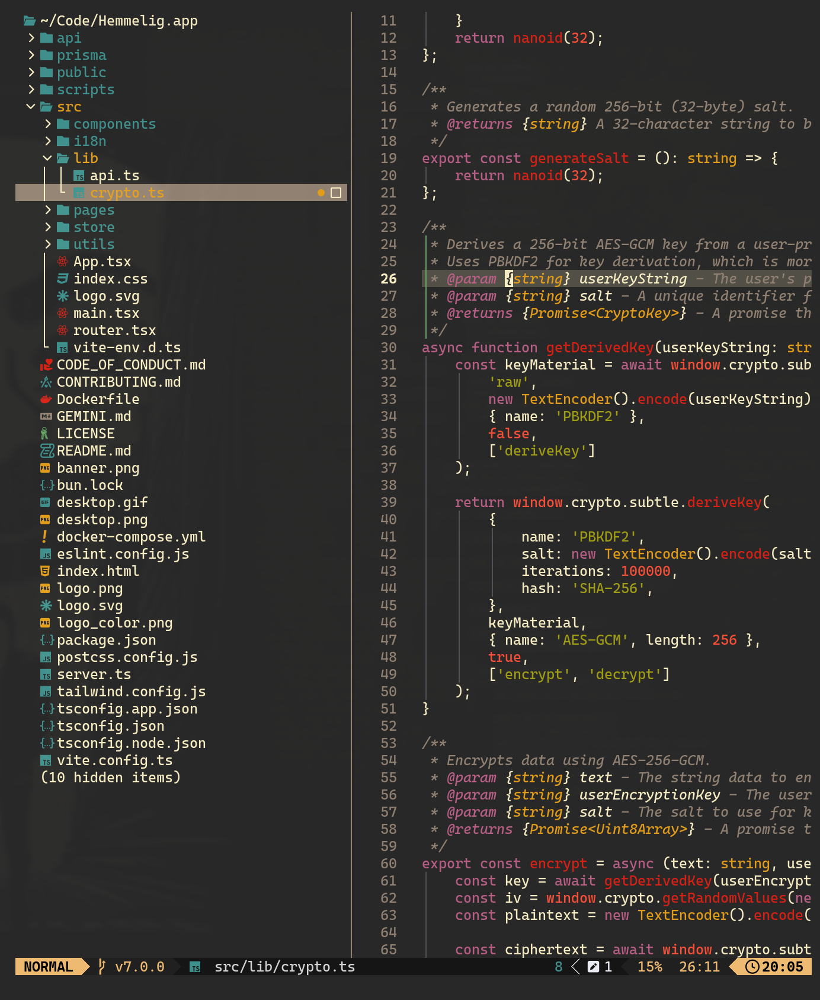

# Aether.nvim

A Neovim colorscheme inspired by TokyoNight, using a well-structured architecture for consistent, customizable theming across your development environment.



## Philosophy

Aether.nvim provides a dark, elegant theme with carefully chosen colors that create a cohesive visual experience. The architecture is inspired by TokyoNight, offering extensive customization options through base16 color injection and plugin support.

## Features

- **Modern Architecture**: Clean, modular design inspired by TokyoNight
- **Base16 Color Injection**: Easy customization through base16 color overrides
- **True Color Support**: Full 24-bit color support with `termguicolors`
- **Extensive Plugin Support**: Built-in support for 25+ popular Neovim plugins
- **Configurable Styles**: Control italics, bold, and other style attributes
- **Transparent Background**: Optional transparent background support
- **Color Callbacks**: Advanced customization with `on_colors` and `on_highlights`
- **Lualine Theme**: Integrated statusline theme with color injection support

## Requirements

- **Neovim 0.8+** (Lua support required)
- Terminal emulator with true color support

## Installation

### Using lazy.nvim

```lua
{
  "bjarneo/aether.nvim",
  priority = 1000,
  config = function()
    require("aether").setup({
      -- Your configuration here
    })
    vim.cmd.colorscheme("aether")
  end,
}
```

### Using packer.nvim

```lua
use {
  "bjarneo/aether.nvim",
  config = function()
    require("aether").setup()
    vim.cmd.colorscheme("aether")
  end,
}
```

### Using vim-plug

```vim
Plug 'bjarneo/aether.nvim'
```

Then in your `init.lua`:

```lua
require("aether").setup()
vim.cmd.colorscheme("aether")
```

### Using with LazyVim

Create a colorscheme plugin file in your LazyVim config:

**File: `~/.config/nvim/lua/plugins/colorscheme.lua`**

```lua
return {
  {
    "bjarneo/aether.nvim",
    priority = 1000,
    opts = {
      transparent = false,
      colors = {
        -- Optional: override colors
        -- base08 = "#ff0000",
      },
    },
  },
  {
    "LazyVim/LazyVim",
    opts = {
      colorscheme = "aether",
    },
  },
}
```

## Configuration

Aether.nvim can be configured with the following options:

```lua
require("aether").setup({
  transparent = false, -- Disable background color
  terminal_colors = true, -- Configure terminal colors
  styles = {
    -- Style applied to different syntax groups
    comments = { italic = true },
    keywords = { italic = true },
    functions = {},
    variables = {},
    -- Background styles for sidebars and floats
    sidebars = "dark", -- "dark", "transparent" or "normal"
    floats = "dark", -- "dark", "transparent" or "normal"
  },
  dim_inactive = false, -- Dim inactive windows
  lualine_bold = false, -- Bold lualine section headers
  
  --- Override colors with base16 injection (easy)
  colors = {
    base00 = "#000000",  -- Background
    base08 = "#f92672",  -- Red
    -- ... more base16 colors
  },
  
  --- Override colors with callback (advanced)
  ---@param colors ColorScheme
  on_colors = function(colors)
    colors.hint = colors.orange
    colors.error = "#ff0000"
  end,
  
  --- Override highlight groups
  ---@param highlights table
  ---@param colors ColorScheme
  on_highlights = function(highlights, colors)
    highlights.Comment = { fg = colors.comment, italic = true }
  end,
  
  cache = true, -- Enable caching for better performance
  
  plugins = {
    -- Enable all plugins by default (when not using lazy.nvim)
    all = package.loaded.lazy == nil,
    -- Auto-enable plugins (detects loaded plugins)
    auto = true,
    -- Or manually enable/disable specific plugins
    -- ["telescope.nvim"] = true,
  },
})
```

### Configuration Examples

#### Transparent Background

```lua
require("aether").setup({
  transparent = true,
  styles = {
    sidebars = "transparent",
    floats = "transparent",
  },
})
```

#### Base16 Color Injection

Aether supports base16 color injection for easy customization:

```lua
require("aether").setup({
  colors = {
    -- Monotone shades
    base00 = "#000000",  -- Background
    base01 = "#282828",  -- Lighter background
    base02 = "#383838",  -- Selection background
    base03 = "#585858",  -- Comments
    base04 = "#b8b8b8",  -- Dark foreground
    base05 = "#d8d8d8",  -- Default foreground
    base06 = "#e8e8e8",  -- Light foreground
    base07 = "#f8f8f8",  -- Light background
    
    -- Accent colors
    base08 = "#f92672",  -- Red (variables, errors)
    base09 = "#fd971f",  -- Orange (numbers, constants)
    base0A = "#f4bf75",  -- Yellow (classes, search)
    base0B = "#a6e22e",  -- Green (strings, git add)
    base0C = "#66d9ef",  -- Cyan (regex, escapes)
    base0D = "#66d9ef",  -- Blue (functions, keywords)
    base0E = "#ae81ff",  -- Magenta (keywords, tags)
    base0F = "#cc6633",  -- Brown (deprecated)
  }
})
```

#### Advanced Color Customization

```lua
require("aether").setup({
  on_colors = function(colors)
    colors.hint = colors.orange
    colors.error = "#ff0000"
    colors.bg = "#0a0a0a"
    colors.git.change = colors.yellow
  end
})
```

#### Customize Highlight Groups

```lua
require("aether").setup({
  on_highlights = function(hl, c)
    hl.Comment = { fg = c.dark5, italic = true }
    hl.Keyword = { fg = c.purple, bold = true }
    hl["@variable"] = { fg = c.fg }
  end,
})
```

## Supported Plugins

Aether.nvim includes highlight groups for 25+ popular plugins:

### Core Language Support
- **LSP**: Diagnostics, semantic highlighting, references, inlay hints
- **Treesitter**: All `@` capture groups for syntax highlighting

### File Management & Navigation
- **Telescope**: Fuzzy finder with preview styling
- **NvimTree**: File explorer with git integration
- **Neo-tree**: Modern file explorer with enhanced features

### Git Integration
- **GitSigns**: Git diff indicators in sign column
- **Diffview**: Side-by-side diff viewer
- **Git**: Commit message and diff highlighting

### Code Enhancement
- **Flash**: Jump/search highlighting
- **Trouble**: Diagnostics and quickfix lists
- **WhichKey**: Keybinding popup interface
- **Indent Blankline**: Indentation guides
- **Comment**: Comment highlighting

### UI & Notifications
- **Noice**: Enhanced UI components and notifications
- **Snacks**: UI utilities and components
- **Fidget**: LSP progress notifications
- **Lualine**: Integrated statusline theme

### Development Tools
- **Blink.cmp**: Completion menu styling
- **nvim-dap**: Debugger interface
- **Conform**: Code formatting
- **Lint**: Linting integration
- **Mini.nvim**: Mini modules support
- **Mason**: Package manager interface
- **Markdown**: Enhanced markdown highlighting

## Lualine Integration

Aether includes a lualine theme that automatically uses your color customizations:

```lua
require("lualine").setup({
  options = {
    theme = "aether",
    -- ... other lualine options
  },
})
```

The lualine theme will automatically use any base16 colors you've injected via `setup({ colors = {...} })`.

## Architecture

Aether.nvim follows a modular architecture:

```
lua/aether/
├── init.lua           -- Main entry point
├── config.lua         -- Configuration options
├── theme.lua          -- Theme setup and application
├── colorscheme.lua    -- Color export for external tools
├── utils.lua          -- Utility functions (blending, etc.)
├── colors/
│   └── init.lua       -- Color palette and injection logic
└── groups/
    ├── init.lua       -- Highlight group loader
    ├── base.lua       -- Base Neovim highlight groups
    ├── treesitter.lua -- Treesitter highlight groups
    ├── lsp.lua        -- LSP and diagnostic highlights
    └── [plugin].lua   -- Plugin-specific highlight groups

lua/lualine/themes/
└── aether.lua         -- Lualine theme with color injection
```

### How Color Injection Works

1. **Default Palette**: Aether starts with a default color palette in `colors/init.lua`
2. **Base16 Injection**: Your `colors = { base08 = "..." }` config overrides base16 colors
3. **Color Derivation**: Theme colors (red, green, blue, etc.) are derived from base16
4. **Git Colors**: Calculated from the final palette colors
5. **Highlight Groups**: All highlight groups reference the final derived colors
6. **External Tools**: Colors cached in `colorscheme.lua` for lualine and other tools

This ensures that when you inject base16 colors, **everything** in the theme uses your custom colors consistently.

## Base16 Color Mapping

Aether follows the base16 specification:

**Monotone Shades** (base00-base07):
- **base00**: Default background
- **base01**: Lighter background (status bars, line numbers)
- **base02**: Selection background
- **base03**: Comments, invisibles
- **base04**: Dark foreground
- **base05**: Default foreground
- **base06**: Light foreground
- **base07**: Light background

**Accent Colors** (base08-base0F):
- **base08**: Variables, errors, functions → `red`
- **base09**: Numbers, constants → `orange`
- **base0A**: Classes, search → `yellow`
- **base0B**: Strings, git add → `green`
- **base0C**: Regex, escapes → `cyan`
- **base0D**: Functions, keywords → `blue`
- **base0E**: Keywords, tags → `purple`/`magenta`
- **base0F**: Deprecated → brown

## Troubleshooting

### Colors appear wrong

Make sure `termguicolors` is enabled (Aether enables it automatically, but check if something overrides it):

```lua
vim.opt.termguicolors = true
```

### Cache Issues

If you experience issues after updates, clear the cache:

```lua
-- In Neovim command mode
:lua require("aether").load({ cache = false })
```

Or manually delete: `~/.cache/nvim/aether-*.json`

### Lualine colors not updating

If your lualine isn't reflecting your color customizations:

1. Make sure you call `require("aether").setup()` **before** `require("lualine").setup()`
2. Restart Neovim to reload the lualine theme
3. Check that you're using `theme = "aether"` in lualine config

### Plugin colors not working

If a plugin isn't styled:

1. Check if the plugin is enabled in `plugins` config (or use `all = true`)
2. Make sure the plugin is loaded before the colorscheme is applied
3. Use `auto = true` to auto-detect loaded plugins

## Contributing

Contributions are welcome! Focus on:

- Adding support for new plugins
- Improving color mappings
- Documentation improvements
- Bug fixes
- Sharing custom color palettes

## License

MIT License.

## Credits

- Inspired by [TokyoNight.nvim](https://github.com/folke/tokyonight.nvim) by @folke
- Architecture and utilities adapted from TokyoNight's excellent design

## Author

Created and maintained by Bjarne Øverli.  
Follow [@iamdothash](https://x.com/iamdothash) on X for updates and more projects.
