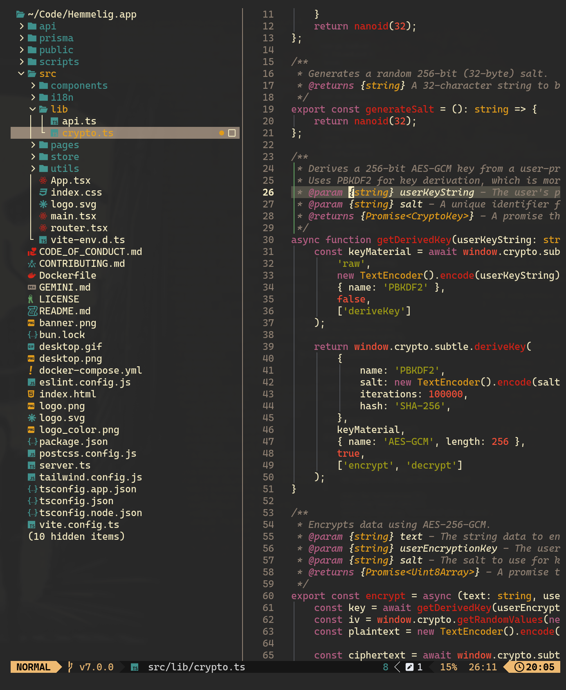

# Aether.nvim

A modern Neovim colorscheme with semantic color customization and extensive plugin support.

> **Note:** This is the `v2` branch with a cleaner API. Use `branch = "v2"` in your plugin config.



## Features

- Direct color injection for easy customization
- Support for 25+ popular Neovim plugins
- Transparent background support
- Hot reload for development
- Lualine theme included

## Requirements

- Neovim 0.8+
- Terminal with true color support

## Installation

### Basic Setup (lazy.nvim)

```lua
{
    "bjarneo/aether.nvim",
    branch = "v2",
    priority = 1000,
    config = function()
        require("aether").setup()
        vim.cmd.colorscheme("aether")
    end,
}
```

### With Custom Colors

```lua
{
    "bjarneo/aether.nvim",
    branch = "v2",
    name = "aether",
    priority = 1000,
    opts = {
        transparent = false,
        colors = {
            -- Background colors
            bg = "#0c0c0c",
            bg_dark = "#0c0c0c",
            bg_highlight = "#1a1a1a",

            -- Foreground colors
            fg = "#f5e8d1",
            fg_dark = "#e4bf7c",
            comment = "#bfac89",

            -- Accent colors
            red = "#d40d09",
            orange = "#fd971f",
            yellow = "#dd920a",
            green = "#969408",
            cyan = "#4a8699",
            blue = "#275d7c",
            purple = "#bb3b74",
            magenta = "#ae81ff",
        },
    },
    config = function(_, opts)
        require("aether").setup(opts)
        vim.cmd.colorscheme("aether")
    end,
}
```

### With Hot Reload (for development)

```lua
{
    "bjarneo/aether.nvim",
    branch = "v2",
    name = "aether",
    priority = 1000,
    opts = {
        colors = {
            bg = "#0c0c0c",
            fg = "#f5e8d1",
            red = "#d40d09",
            -- ... your colors
        },
    },
    config = function(_, opts)
        require("aether").setup(opts)
        vim.cmd.colorscheme("aether")

        -- Enable hot reload - theme auto-reloads when you save lua files
        require("aether.hotreload").setup()
    end,
}
```

### With LazyVim

Create `~/.config/nvim/lua/plugins/colorscheme.lua`:

```lua
return {
    {
        "bjarneo/aether.nvim",
        branch = "v2",
        name = "aether",
        priority = 1000,
        opts = {
            colors = {
                bg = "#0c0c0c",
                fg = "#f5e8d1",
                comment = "#bfac89",
                red = "#d40d09",
                orange = "#f6312d",
                yellow = "#dd920a",
                green = "#969408",
                cyan = "#4a8699",
                blue = "#275d7c",
                purple = "#bb3b74",
                magenta = "#ae81ff",
            },
        },
        config = function(_, opts)
            require("aether").setup(opts)
            vim.cmd.colorscheme("aether")

            -- Optional: Enable hot reload
            require("aether.hotreload").setup()
        end,
    },
    {
        "LazyVim/LazyVim",
        opts = {
            colorscheme = "aether",
        },
    },
}
```

## Configuration Options

```lua
require("aether").setup({
    transparent = false,           -- Enable transparent background
    terminal_colors = true,        -- Configure terminal colors
    dim_inactive = false,          -- Dim inactive windows
    lualine_bold = false,          -- Bold lualine section headers

    styles = {
        comments = { italic = true },
        keywords = { italic = true },
        functions = {},
        variables = {},
        sidebars = "dark",         -- "dark", "transparent", or "normal"
        floats = "dark",           -- "dark", "transparent", or "normal"
    },

    -- Color customization (override any palette color)
    -- These colors automatically propagate to their variants
    colors = {
        -- Background colors
        bg = "#000000",            -- Default background → bg_dark, bg_dark1
        bg_dark = "#000000",       -- Sidebars, statusline (optional override)
        bg_highlight = "#000000",  -- Cursorline, selection

        -- Foreground colors
        fg = "#d8d8d8",            -- Default text color
        fg_dark = "#b8b8b8",       -- Statusline, inactive → dark5
        comment = "#585858",       -- Comments → dark3, fg_gutter, terminal_black

        -- Accent colors (propagate to variants)
        red = "#f92672",           -- Errors, deletions → red1
        orange = "#fd971f",        -- Numbers, constants
        yellow = "#f4bf75",        -- Types, classes
        green = "#a6e22e",         -- Strings → green1, green2
        cyan = "#66d9ef",          -- Regex, PreProc, Special → teal
        blue = "#66d9ef",          -- Keywords, info → blue0-7
        purple = "#ae81ff",        -- Keywords, tags → magenta
        magenta = "#ae81ff",       -- Functions, identifiers → magenta2

        -- Optional: directly set if you want different values
        special_char = "#cc6633",  -- Escape sequences (\n, \t)
    },

    -- Advanced: Customize derived colors
    on_colors = function(colors)
        colors.hint = colors.orange
        colors.error = "#ff0000"
    end,

    -- Advanced: Customize highlight groups
    on_highlights = function(hl, colors)
        hl.Comment = { fg = colors.comment, italic = true }
    end,

    plugins = {
        all = package.loaded.lazy == nil,  -- Enable all when not using lazy.nvim
        auto = true,                       -- Auto-detect loaded plugins
    },
})
```

## Color Reference

When you inject colors, they automatically propagate to their variants:

| Injected Color | Propagates To | Used For |
|----------------|---------------|----------|
| `bg` | `bg_dark`, `bg_dark1` | Editor background, sidebars |
| `fg_dark` | `dark5` | Statusline, inactive text |
| `comment` | `dark3`, `fg_gutter`, `terminal_black` | Comments, line numbers |
| `red` | `red1` | Errors, git delete |
| `green` | `green1`, `green2` | Strings, git add |
| `blue` | `blue0`-`blue7` | Keywords, operators, info |
| `cyan` | `teal` | Regex, PreProc, Special, hints |
| `purple` | `magenta` | Keywords, tags |
| `magenta` | `magenta2` | Functions, identifiers |

**All injectable colors:**
- `bg`, `bg_dark`, `bg_highlight` - Backgrounds
- `fg`, `fg_dark`, `comment` - Foregrounds
- `red`, `orange`, `yellow`, `green`, `cyan`, `blue`, `purple`, `magenta` - Accents
- `special_char` - Escape sequences in strings

## Base16 Compatibility (Legacy)

For backwards compatibility, base16 color names are still supported and automatically mapped:

```lua
colors = {
    -- These base16 names still work and map to semantic colors
    base00 = "#000000",  -- → bg (default background)
    base01 = "#282828",  -- → terminal_black (lighter background)
    base02 = "#383838",  -- → bg_highlight (selection background)
    base03 = "#585858",  -- → comment, fg_gutter (comments, line numbers)
    base04 = "#b8b8b8",  -- → fg_dark (dark foreground)
    base05 = "#d8d8d8",  -- → fg (default foreground)
    base08 = "#f92672",  -- → red (errors, variables)
    base09 = "#fd971f",  -- → orange (numbers, constants)
    base0A = "#f4bf75",  -- → yellow (types, classes)
    base0B = "#a6e22e",  -- → green (strings)
    base0C = "#66d9ef",  -- → cyan, teal (regex, escapes)
    base0D = "#66d9ef",  -- → blue (functions, keywords)
    base0E = "#ae81ff",  -- → purple, magenta (keywords, storage)
    base0F = "#cc6633",  -- → special_char (escape sequences)
}
```

## Hot Reload

Hot reload automatically refreshes the theme when you edit plugin files or your config.

### Enable Hot Reload

```lua
require("aether.hotreload").setup()
```

### Manual Reload

```vim
:AetherReload
```

## Lualine Integration

```lua
require("lualine").setup({
    options = {
        theme = "aether",
    },
})
```

The lualine theme automatically uses your custom colors.

## Supported Plugins

### Core
- LSP (diagnostics, semantic tokens)
- Treesitter
- Markdown

### File Navigation
- Telescope
- NvimTree
- Neo-tree

### Git
- GitSigns
- Diffview
- Git (commit/diff)

### UI/Utilities
- Flash
- Trouble
- WhichKey
- Indent Blankline
- Noice
- Snacks
- Fidget
- Lualine

### Development
- Blink.cmp
- nvim-dap
- Conform
- Lint
- Mini.nvim
- Mason
- Comment

## Creating Theme Variants

You can create your own colorscheme variant with a custom name by creating a `colors/*.lua` file in your Neovim config:

**~/.config/nvim/colors/hackerman.lua:**
```lua
-- Load aether with custom config
require("aether").load({
    name = "hackerman",
    colors = {
        bg = "#000000",
        fg = "#00ff00",
        green = "#00ff00",
        -- etc...
    },
})
```

Then use it like any other colorscheme:
```vim
:colorscheme hackerman
```

## Examples

### Transparent Background

```lua
require("aether").setup({
    transparent = true,
    styles = {
        sidebars = "transparent",
        floats = "transparent",
    },
})
```

### Custom Accent Colors

```lua
require("aether").setup({
    colors = {
        red = "#ff5555",
        green = "#50fa7b",
        blue = "#8be9fd",
    },
})
```

### Disable Italics

```lua
require("aether").setup({
    styles = {
        comments = {},
        keywords = {},
    },
})
```

## Troubleshooting

### Colors look wrong

Ensure true colors are enabled:
```lua
vim.opt.termguicolors = true
```

### Theme not applying

Make sure you call `vim.cmd.colorscheme("aether")` after `setup()`:
```lua
require("aether").setup({ ... })
vim.cmd.colorscheme("aether")
```

## License

MIT License

## Credits

- Inspired by [TokyoNight.nvim](https://github.com/folke/tokyonight.nvim)

## Author

Created by Bjarne Øverli - [@iamdothash](https://x.com/iamdothash)
